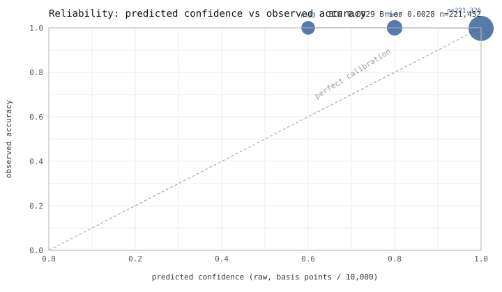

<!-- GENERATED FILE - DO NOT EDIT BY HAND.
     Regenerate with `make evidence`. Every number below comes from a real
     run of the engine over synthetic data with known planted truth.
     Any manual edit changes the body hash and fails scripts/check_evidence.py.
     body-sha256: 7372463324668a2055ecad9814a650b42d9949a2230d1409cd3979972a9ab514 -->
# EVIDENCE

How well Assay actually works, measured against synthetic settlement months
with known planted discrepancies. Generated by `make evidence`.

**The number worth reading first.** Across 18 audited months, the engine
claimed **₹0.00** that was not there
(0 false-positive findings out of 1400),
while recovering **55.2%** of the rupees actually planted.
A system that over-claims is worse than one that under-claims, so that number
is stated before any of the flattering ones. §4 breaks it down.

## 1. Reproduction

| | |
|---|---|
| Run timestamp | 2026-08-26T20:38:23.744247+00:00 |
| Git commit | `63d114f3e0042036d28e2099962c04c05993985e` |
| Contract version | `rc-bac663f10b17` |
| Calibration artifact | `bbfefb7533f3e42004dafa41e038fb4cf96f12c49f33c931cacf26535da4703d` |
| Profiles | clean, realistic, stress |
| Seeds evaluated | 15, 16, 17, 18, 19, 20 |
| Seeds the calibration was fitted on | 1, 2, 3, 4, 5, 6, 7, 8, 9, 10, 11, 12, 13, 14 |
| Python | 3.11.15 |
| Platform | Windows 10 (AMD64) |
| Wall clock (whole sweep) | 482.2s |

The evaluation seeds and the calibration seeds are disjoint. §8 and §9
would otherwise be reporting how well the calibration artifact memorised
its own training data.

**Model at each LLM boundary**

| Boundary | Model |
|---|---|
| `llm/contract_parser.py` | `gemini-2.5-flash` |
| `llm/adjudicator.py` | `gemini-2.5-flash` |
| `llm/narrator.py` | `gemini-flash-lite-latest` |

**Input file hashes** — SHA-256 of the four files of the committed
reference run, `runs/realistic-seed42`, which §12's determinism check
audits. The 18 sweep runs are generated in memory from
(profile, seed); their per-run input hashes are in `eval/results/`.

| File | SHA-256 |
|---|---|
| `bank_statement.json` | `0d22105380f5c090fdb9c100219b3d7e2c450dc2b8dc937200bbd220c6ec9414` |
| `ledger.json` | `050dcc6d880696391160aa023d4c98d3f8ac388a2c0a69689eb21c241da523bc` |
| `rate_card.md` | `8ea5fbc5df5f0ecd9ea4d59d3918b338e06b9d8eccd84467d27cfcad3d4d3d63` |
| `settlement_report.json` | `b4b36d14e6d94fd110fe48c6e76b930ffa22afcb3c9450de57b3904d4ae1142a` |

## 2. Detection quality

Two tables, because one would have to invent a number.

`DiscrepancyEntry.code` (D01–D12) is finer than `DiscrepancyClass`: five
codes (D01, D03, D10, D11, D12) all plant a fee over/undercharge, and D04
and D06 both plant a refund mismatch. A **true positive is attributable to
a code**, through the records it touched. A **false positive is not** —
there is no fact of the matter about which code a spurious fee finding
"should" have been. So recall lives in table A, where it is exact, and
precision lives in table B, where it is.

**Table A — per planted code**

| code | class(es) | support | TP | FN | recall | value-recall |
|---|---|---|---|---|---|---|
| D01 | fee_overcharge, fee_undercharge | 168 | 168 | 0 | 100.0% | 100.0% |
| D02 | tax_miscalculation | 114 | 114 | 0 | 100.0% | 100.0% |
| D03 | fee_overcharge | 24 | 24 | 0 | 100.0% | 100.0% |
| D04 | refund_amount_mismatch | 108 | 57 | 51 | 52.8% | 67.4% |
| D05 | chargeback_amount_mismatch | 12 | 12 | 0 | 100.0% | 100.0% |
| D06 | refund_amount_mismatch | 114 | 0 | 114 | 0.0% | 0.0% |
| D07 | rounding_drift | 78 | 0 | 78 | 0.0% | 0.0% |
| D08 | missing_transaction | 108 | 89 | 19 | 82.4% | 79.3% |
| D09 | data_quality_flag | 126 | 0 | 126 | 0.0% | 0.0% |
| D10 | fee_overcharge, fee_undercharge | 114 | 114 | 0 | 100.0% | 100.0% |
| D11 | fee_overcharge | 108 | 108 | 0 | 100.0% | 100.0% |
| D12 | fee_overcharge | 102 | 102 | 0 | 100.0% | 100.0% |
| **all** |  | **1176** | **788** | **388** | **67.0%** | **55.2%** |

D09 is a data-quality flag, not a discrepancy: it corrupts a UTR and costs
zero rupees, and no detector in `core/verify.py` claims it. Its row reads
what it is rather than being excluded.

**Table B — per discrepancy class**

| class | support | TP | FP | FN | precision | recall | F1 |
|---|---|---|---|---|---|---|---|
| fee_overcharge | 579 | 290 | 0 | 289 | 100.0% | 50.1% | 66.7% |
| fee_undercharge | 452 | 226 | 0 | 226 | 100.0% | 50.0% | 66.7% |
| tax_miscalculation | 114 | 114 | 593 | 0 | 16.1% | 100.0% | 27.8% |
| missing_transaction | 127 | 89 | 0 | 38 | 100.0% | 70.1% | 82.4% |
| refund_amount_mismatch | 222 | 57 | 0 | 165 | 100.0% | 25.7% | 40.9% |
| chargeback_amount_mismatch | 12 | 12 | 0 | 0 | 100.0% | 100.0% | 100.0% |
| rounding_drift | 156 | 0 | 0 | 156 | 0.0% | 0.0% | 0.0% |
| unreconciled_residual | 0 | 0 | 19 | 0 | 0.0% | 0.0% | 0.0% |
| **macro avg** |  |  |  |  | **64.5%** | **49.5%** | **48.1%** |
| **micro avg** |  |  |  |  | **56.3%** | **47.4%** | **51.5%** |

Macro average is over classes actually planted or predicted; including
never-exercised taxonomy members would report how many enum members exist
rather than how well the engine did.

> **The FP column here is not §4's number, and the two must not be
> conflated.** This table derives from §5's confusion matrix in the
> textbook way: a class's false positives are every finding that *predicted*
> that class whose true class was something else — which includes findings
> that landed on a real planted defect and named the wrong class. §4's
> headline counts only findings that touch no planted record at all. Both
> definitions are standard; they answer different questions. "How often is
> this class's label right?" is this table. "How many rupees did the system
> claim that were never missing?" is §4, and it is the smaller and more
> serious number.

**A third outcome, counted separately.** 612
findings (₹31,998.69) landed on a genuinely
planted defect but named a different class. Those are neither successes nor
false claims: one planted D01 changes a fee line *and* the tax computed on
it, so the engine correctly emits a fee finding and a tax finding, and only
the first matches D01's own class. They are counted as misclassifications,
kept out of §4's "falsely claimed" total, and visible in §5's matrix.

## 3. Value-weighted recall

Rupees of planted loss detected, over rupees planted. This matters more
than count-recall: missing one ₹40,000 error is worse than missing forty
₹100 errors. Both are shown so the difference is visible.

| code | planted | detected | value-recall | count-recall |
|---|---|---|---|---|
| D01 | ₹479.45 | ₹479.45 | 100.0% | 100.0% |
| D02 | ₹26,091.59 | ₹26,091.59 | 100.0% | 100.0% |
| D03 | ₹1,051.67 | ₹1,051.67 | 100.0% | 100.0% |
| D04 | ₹103,390.20 | ₹69,642.17 | 67.4% | 52.8% |
| D05 | ₹9,834.95 | ₹9,834.95 | 100.0% | 100.0% |
| D06 | ₹121,623.29 | ₹0.00 | 0.0% | 0.0% |
| D07 | ₹0.78 | ₹0.00 | 0.0% | 0.0% |
| D08 | ₹150,141.97 | ₹119,013.91 | 79.3% | 82.4% |
| D09 | ₹0.00 | ₹0.00 | 0.0% | 0.0% |
| D10 | ₹112.11 | ₹112.11 | 100.0% | 100.0% |
| D11 | ₹391.76 | ₹391.76 | 100.0% | 100.0% |
| D12 | ₹2,745.87 | ₹2,745.87 | 100.0% | 100.0% |
| **all** | **₹415,863.64** | **₹229,363.48** | **55.2%** | **67.0%** |

Overall value-recall is **55.2%** against a
count-recall of **67.0%** — value-recall sits
11.9 percentage points below count-recall, meaning the
errors this engine misses are larger than average.
That gap is the point of this section: a system judged only on how many
discrepancies it caught would look far better than one
judged on how many rupees it recovered.

## 4. False-positive money impact

**0 false-positive findings, claiming
₹0.00 that was not there.**

A false positive here is a finding whose evidence touches *no* planted
record at all — it points somewhere nothing was wrong. A finding that lands
on a real defect but names the wrong class is a misclassification
(612 of them,
₹31,998.69) and is excluded from this total,
because it did not claim money that was not there.

| profile | findings | false positives | rupees falsely claimed | FP rate |
|---|---|---|---|---|
| clean | 0 | 0 | ₹0.00 | 0.00% |
| realistic | 320 | 0 | ₹0.00 | 0.00% |
| stress | 1080 | 0 | ₹0.00 | 0.00% |
| **all** | **1400** | **0** | **₹0.00** | **0.00%** |

**Which boundary produced them.** **None of these came from the LLM adjudicator**; every one was produced by the deterministic engine in `core/verify.py`.

**What they claimed to be**

_No false positives._

A merchant taking these findings to a gateway is putting their credibility
behind each one. Over-claiming costs more than under-claiming, which is why
this section is the fourth thing in the document and not the last.

## 5. Confusion matrix

Rows are what was planted; columns are what the engine called it. The
`not_detected` column is a plant nothing found. The `no_discrepancy` row
is a finding on records where nothing was planted — that row is §4's
false-positive count, laid out by the class each one claimed.

| true \ predicted | chargeback_amount_mismatch | fee_overcharge | fee_undercharge | missing_transaction | refund_amount_mismatch | tax_miscalculation | unreconciled_residual | not_detected |
|---|---|---|---|---|---|---|---|---|
| chargeback_amount_mismatch | 12 | 0 | 0 | 0 | 0 | 0 | 0 | 0 |
| data_quality_flag (D09) | 0 | 0 | 0 | 0 | 0 | 0 | 0 | 126 |
| fee_overcharge | 0 | 290 | 0 | 0 | 0 | 289 | 0 | 0 |
| fee_undercharge | 0 | 0 | 226 | 0 | 0 | 226 | 0 | 0 |
| missing_transaction | 0 | 0 | 0 | 89 | 0 | 0 | 19 | 19 |
| refund_amount_mismatch | 0 | 0 | 0 | 0 | 57 | 0 | 0 | 165 |
| rounding_drift | 0 | 0 | 0 | 0 | 0 | 78 | 0 | 78 |
| tax_miscalculation | 0 | 0 | 0 | 0 | 0 | 114 | 0 | 0 |

## 6. Decomposition quality

Every bank credit is decomposed into the exact transactions that produced
it, through three tiers: structural (UTR/batch join), subset-sum search,
and a batched assignment.

| tier | credits reaching it | resolved there | share of all credits |
|---|---|---|---|
| structural | 432 | 432 | 77.4% |
| subset_sum | 93 | 93 | 16.7% |
| assignment | 33 | 33 | 5.9% |
| **all** | **558** | **558** | **100.0%** |

**Ambiguous but reported: 0.** None arose in this sweep -- but the policy is what matters, and it is worth stating. An ambiguous outcome means two or more transaction sets explain the same
credit equally well, and the engine says so and names the competing
candidates rather than picking one. Reporting the ambiguity is the correct
answer; silently choosing would produce a confident, fully-verifying proof
over possibly the wrong records — the exact failure `core/decompose.py`
exists to make impossible. A zero here reflects this generator's own data, which gives most credits a clean structural key; it is not evidence that real settlement files are unambiguous.

**Unresolved: 0**, broken down by the reason each one names.
The vocabulary is fixed (`DecompositionReason`); no free-text reasons exist
to be uncountable here.

_No credit failed to resolve in this sweep._

## 7. Conservation

For every bank credit, in paise, with no tolerance:

```
credit = settled_gross - refunds - fees - tax - chargebacks - adjustments
       + reversals + unexplained
```

`unexplained` is a first-class reportable bucket, asserted at the end of
every run. It has two halves, and reporting only the first would let a
whole lost settlement batch read as clean: residual on credits that
exist, plus records no credit ever claimed.

| | |
|---|---|
| Unexplained (residual on credits) | -₹103,390.20 |
| Unclaimed (records no credit claimed) | ₹151,248.15 |
| **Total unaccounted** | **₹47,857.95** |
| Settled volume | ₹120,005,440.14 |
| Unaccounted as bps of volume | **3.99 bps** |

| profile | unexplained | unclaimed | total unaccounted | bps of volume |
|---|---|---|---|---|
| clean | ₹0.00 | ₹0.00 | ₹0.00 | 0.00 |
| realistic | -₹20,830.44 | ₹21,201.18 | ₹370.74 | 0.09 |
| stress | -₹82,559.76 | ₹130,046.97 | ₹47,487.21 | 11.89 |

**The clean profile reconciles to exactly zero.** `₹0.00` unaccounted across every clean-profile run — not rounded to zero, not within tolerance. Zero.

## 8. Calibration

Predicted confidence against observed accuracy, over
221,452 labelled decisions from the three raw confidence
sources (decomposition tier, deterministic recomputation, adjudicator
coverage).

| confidence bucket | n | mean predicted | observed accuracy | gap |
|---|---|---|---|---|
| 0.6–0.7 | 33 | 0.600 | 1.000 | +0.400 |
| 0.8–0.9 | 93 | 0.800 | 1.000 | +0.200 |
| 0.9–1.0 | 221326 | 1.000 | 0.997 | -0.003 |

| | |
|---|---|
| Expected calibration error | **0.0029** |
| Brier score | **0.0028** |

A positive gap is underconfidence — the engine was right more often than it
claimed. A negative gap is the dangerous direction.



The diagram is committed at `docs/reliability.svg` (byte-deterministic, so a
regeneration over unchanged results produces an unchanged file) and at
`docs/reliability.png`.

## 9. Conformal guarantee

| | |
|---|---|
| Target error rate | 50 bps (0.50%) |
| Confidence level | 95% |
| Derived AUTO threshold | **unreachable** — no threshold was certified |
| ESCALATE threshold | ≤ 3830 bps |
| Fitted on seeds | 1, 2, 3, 4, 5, 6, 7, 8, 9, 10, 11, 12, 13, 14 |
| Evaluated on seeds | 15, 16, 17, 18, 19, 20 |

_No coverage table: the fit could not certify the target error rate at any threshold, for at least one confidence source, so AUTO is unreachable and the set of auto-posted items is empty._

This is the honest outcome, not a missing feature. `auto_min_calibrated_bps` is `null` in the committed artifact, and `core/lanes.py` keeps it `null` rather than clamping it to 10,000 — which would turn "no threshold satisfies the guarantee" into "the threshold is exactly certainty", a strictly more permissive claim than the fit supports. Nothing auto-posts. The consequence is visible in §13's calibration ablation: a fixed 0.9 threshold *would* have auto-posted, and what it would have posted is exactly the risk the conformal fit refused to certify.

**Volume share by lane**

| lane | findings | share of findings | rupees | share of rupees |
|---|---|---|---|---|
| auto | 0 | 0.0% | ₹0.00 | 0.0% |
| escalate | 0 | 0.0% | ₹0.00 | 0.0% |
| propose | 1400 | 100.0% | ₹261,598.50 | 100.0% |

## 10. LLM boundary

This is the AI-judgment argument, in numbers. The engine is deterministic
Python; a model is consulted at exactly three boundaries and never computes,
adjusts or approves an amount.

| | |
|---|---|
| **Records that touched a model at all** | **108 of 320,749 (0.03%)** |
| Total provider calls (whole sweep) | 36 |
| Calls per 1,000 records | 0.11 |
| Residuals submitted for adjudication | 108 |
| Schema validation rejection rate | 0.00% (0 of 36) |
| Reference-check rejection rate | 0.00% (0 of 108 citations) |
| **Fabricated record IDs caught** | **0** |
| Real records cited but never shown | 0 |
| Cache hit rate | 50.0% (18 hits / 36 calls) |
| Calls that reached the network | 18 |
| 429s observed | 0 |
| Time spent in backoff | 0.0s |
| Rate-limit config this ran under | 15 RPM, 3 retries, 1.0s base backoff |
| Tokens (prompt / response / total) | 27,936 / 41,942 / 90,201 |
| Tokens per 1,000 records | 281 |
| Runs where adjudication degraded | 0 of 18 |

**Token counts** (18 of 36 calls' tokens are byte-length estimates, from cache entries recorded before usage tracking existed; the rest are the API's own reported counts).

**Prompt and response do not sum to the total**, and that is the API's own accounting rather than an error here: 20,323 tokens are billed to the call but attributed to neither side — reasoning tokens the model spent before answering. The total is what a bill would show, so the total is what the cost below is computed from.

**What this would cost.** The build ran entirely on the Gemini free tier and
paid nothing. At an assumed paid-tier list price of
$0.30/M input and
$2.50/M output tokens, this sweep's
90,201 tokens would cost **$0.1640** —
about **$0.0005 per 1,000
records** audited. Those rates are an assumption, not a measurement; vendor
pricing moves, and the figure to update is in `eval/sweep.py`.

A schema-invalid batch response aborts its whole batch rather than being
repaired, and an unavailable provider degrades the adjudication rather than
guessing — so a rejection rate of zero above means no rejection occurred,
never that one was absorbed.

## 11. Throughput

| | |
|---|---|
| Records audited | 320,749 |
| Payments audited | 93,600 |
| Wall clock (audit time only) | 234.6s |
| Records/sec | **1,367** |
| First run, cold cache | 10.0s |
| A run served entirely from cache | 1.9s |

**Analyst-hours equivalent.** At an assumed
40 transactions reconciled per hour by hand —
a deliberately generous rate, since a pessimistic one would flatter the
tool — the 93,600 payments here represent about
**2,340 analyst-hours**, done in
235 seconds. The assumption is stated so it
can be argued with; the honest comparison is not "faster than a human" but
"a human would not do this at all, at this volume, line by line".

## 12. Determinism

Invariant 4 promises that the same inputs, contract version and seed
produce a byte-identical report carrying a SHA-256 of its own canonical
JSON. Checked by auditing `runs/realistic-seed42` twice and comparing.

| | |
|---|---|
| Run 1 report hash | `73017d52d7a41599e1977542925b3518ef67d8501b02123aaa2d3e370335c02e` |
| Run 2 report hash | `73017d52d7a41599e1977542925b3518ef67d8501b02123aaa2d3e370335c02e` |
| Verdict | **match** |
| Replay hash (cache only, no network) | `73017d52d7a41599e1977542925b3518ef67d8501b02123aaa2d3e370335c02e` |
| Replay matches, live API calls made | 0 |

The hash covers what the audit concluded and excludes what it observed
about the machine it ran on: per-proof `elapsed_ns`, the run's own start
time and wall clock, each journal entry's `posted_at`, and all LLM
telemetry. It does *not* exclude calibrated lane assignments — the
calibration artifact is an input, and `calibration_sha256` records which
one was used.

A run whose decomposition hit the wall-clock budget carries no
byte-identical guarantee at all and is refused rather than scored
(`eval/determinism.py`). No run in this sweep hit it.

## 13. Ablation study

Does the AI actually earn its place. Each component is disabled, one at a
time, and the whole sweep is re-scored.

| configuration | value-recall | Δ | rupees falsely claimed | Δ |
|---|---|---|---|---|
| **baseline (everything on)** | **55.2%** | — | **₹0.00** | — |
| deterministic engine only | 26.5% | -28.6pp | ₹0.00 | +₹0.00 |
| fixed 0.9 confidence threshold | 55.2% | +0.0pp | ₹0.00 | +₹0.00 |
| tier 1 matching only | 15.0% | -40.1pp | ₹0.00 | +₹0.00 |
| model citations trusted | 55.2% | +0.0pp | ₹0.00 | +₹0.00 |

- **deterministic engine only** — residual hypotheses are never proposed; only core/verify.py's findings remain. findings removed: 108.
- **fixed 0.9 confidence threshold** — lanes assigned by a round number instead of a fitted, per-source conformal bound. actually auto posted: 0, would auto post: 1,400, would auto post: ₹261,598.50.
- **tier 1 matching only** — UTR/batch joins alone -- no subset-sum search, no batched assignment. credits resolved: 432, credits total: 558, unexplained: ₹26,888,383.11.
- **model citations trusted** — invariant 6's reference check disabled; cited record ids are not verified to exist. fabricated ids admitted: 0.

**A row with no delta is a real result, not a missing measurement.** *fixed 0.9 confidence threshold*, *model citations trusted* changed neither recall nor false-positive rupees in this sweep. For the reference checker that follows directly from §10: the model fabricated **zero** record ids here, so a checker that catches fabrications had nothing to catch. It is insurance that did not fire — which is evidence about this sweep's model output, not evidence that the check is unnecessary. Removing a guard is only free until the day it isn't.

Two of these deserve reading together. Removing the **adjudicator** costs
recall on residuals that deterministic matching could not explain — that is
what the model is for. Removing **conformal calibration** costs nothing in
recall and everything in safety: a fixed
0.9 threshold auto-posts findings the
calibrated system refuses to, and the calibrated system refuses precisely
because the fit could not certify that error rate. The reference-checker
ablation prices invariant 6 directly, in fabricated record ids that would
otherwise have reached a report.

The structural-only row is a genuine re-run, not an approximation:
`decompose_all` completes its structural phase over every credit before any
credit falls to tier 2, so a structural result never depends on what the
later tiers did.

## 14. Limitations

Plainly, without softening.

**This is synthetic data.** Every number above is measured against months
generated by `datagen/`, where the truth is known because this project
planted it. That proves the engine finds what `datagen/` knows how to hide,
and nothing more. It does not prove the engine finds what a real gateway
does wrong.

**What it does prove.** The arithmetic is right, the conservation identity
holds exactly on data engineered to break it, the decomposition resolves
real many-to-many credit/batch structure, ambiguity is reported rather than
guessed, and the model boundary is small enough to measure
(0.03% of records) and
validated by a reference check that had nothing to catch in this sweep — the model fabricated zero record ids here, which is a fact about this sweep's output and not a demonstration that the check works.

**The largest single gap: classes with no detector at all.** ₹121,624.07 of the ₹415,863.64 planted (29.2%) sits in discrepancy classes this engine never claims — not misclassified, not low-confidence, simply not looked for. This is most of the distance between the value-recall above and 100%, and it is a missing feature rather than a broken one.

| code | class(es) | planted | why |
|---|---|---|---|
| D06 | refund_amount_mismatch | ₹121,623.29 | a refund attributed to the wrong settlement batch leaves NO residual at all -- both the true and the wrong batch fully verify against their own corrupted record sets -- and refunds can legitimately settle in a later cycle than their payment, so "settlement must match" is not a safe rule; no deterministic check is attempted |
| D07 | rounding_drift | ₹0.78 | sub-paisa rounding drift surfaces as a tax delta and is reported as `tax_miscalculation` |

**What would change against production data.**
- Real rate cards are worse than generated ones: PDFs, addenda in email,
  clauses that contradict each other. `llm/contract_parser.py` is validated
  against schema, overlap and completeness, but there is no second
  independent check that it *read the card correctly*, and no test yet
  asserts a compiled contract reproduces the undisputed majority of a real
  settlement's own fees.
- The generator gives most credits a distinct UTR pointing at a distinct
  batch. Real settlement files do not guarantee that bijection, and the
  tiers below structural matching would carry far more of the load.
- `core/verify.py` matches a won chargeback to its reversal by amount
  alone, ignoring `Adjustment.reason` and `settlement_id`. Round rupee
  amounts recur in production; this would false-negative.
- Currency is assumed to be INR throughout. `core/contract.py` does not
  check a payment's currency against the rate card's declared currency, so
  a foreign-currency payment would be priced by whichever INR-paise band
  its minor-unit amount happened to land in.

**Known gaps in what is measured here.**
- D09 (corrupted UTR) has no detector. It is a data-quality flag with zero
  rupee impact, and its recall is honestly 0.
- The clean profile plants nothing, so it contributes support to no class.
  It is included because a zero-discrepancy month reconciling to exactly
  zero is itself a result worth showing (§7).
- The contract used by every run above has no recorded human sign-off.
  `core/contract.py::require_signoff` exists and is tested, but no
  `*.signoff.json` is committed and `run_audit` does not gate on one. A
  production deployment must.
- 18 runs on 6 seeds per profile is enough
  to see the shape of the per-class numbers and not enough to put a tight
  confidence interval on the sparse classes — D03 and D05 plant as few as
  one instance per month.
